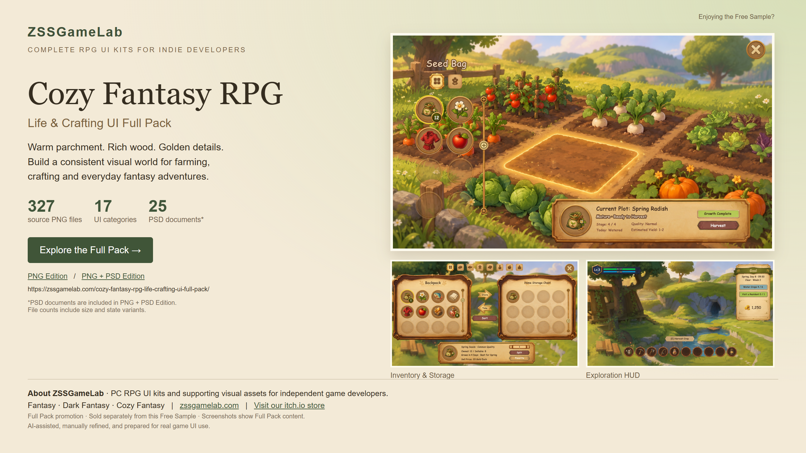

# Discover the Cozy Full Pack

## Cozy Fantasy RPG — Life & Crafting UI Full Pack

Bring warm parchment panels, wood textures and golden frames to your cozy fantasy RPG. Explore UI graphics and layouts for farming, inventory, crafting, cooking, housing and everyday community life.

- 327 source PNG files across 17 UI categories. File counts include size and state variants.
- Choose PNG Edition, or PNG + PSD Edition with 25 PSD source documents.
- UI graphics and source layouts; gameplay logic and engine integration are not included.

[Explore the Full Pack and compare editions](https://zssgamelab.com/cozy-fantasy-rpg-life-crafting-ui-full-pack/)

[Get PNG Edition on itch.io](https://zss-game-lab.itch.io/cozy-fantasy-rpg-life-crafting-ui-full-pack-png-edition) · [Get PNG + PSD Edition on itch.io](https://zss-game-lab.itch.io/cozy-fantasy-rpg-life-crafting-ui-full-pack-png-psd-edition)

The Full Pack is a separate product. Its promotional screenshots do not expand the contents of this Free or Starter download. See INCLUDED_ASSETS.csv for this folder's actual assets.

## About ZSSGameLab

ZSSGameLab creates complete PC RPG UI kits and supporting visual assets for independent game developers. Our Fantasy, Dark Fantasy and Cozy Fantasy collections help developers keep menus, HUDs, inventory and icons visually consistent.

AI-assisted, manually refined, and prepared for real game UI use.

[Visit ZSSGameLab](https://zssgamelab.com/) · [Browse our itch.io store](https://zss-game-lab.itch.io/)

[Open the clickable promotional page](cozy_full_pack_promo.html)
